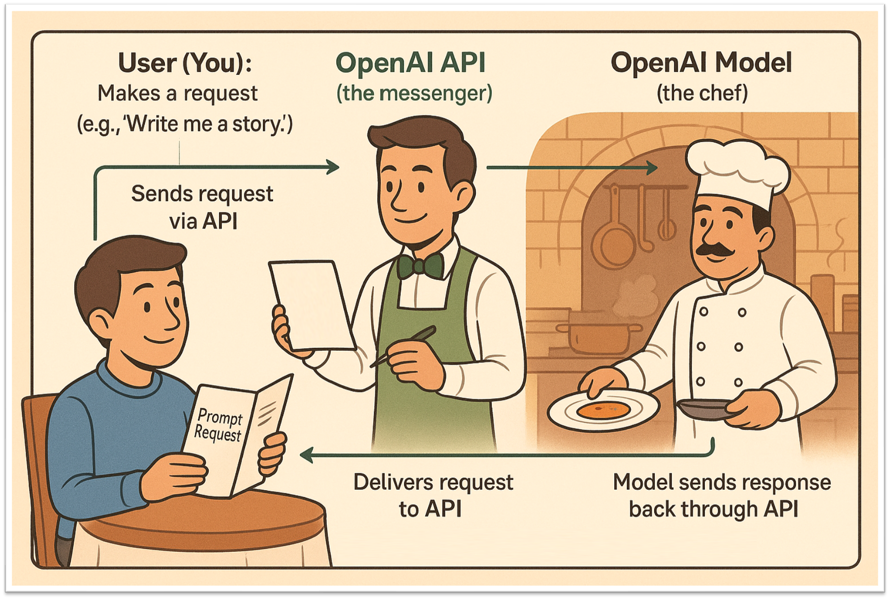

<h1> Tilburg.ai OpenAI API Workshop</h1>

## Tutorial OpenAI API

Welcome to the official repository for the **Tilburg.ai OpenAI API Workshop**, organized as part of Tilburg University's Research Infrastructure program.

---

## Workshop Overview

This tutorial goes beyond basic ChatGPT usage to provide hands-on experience with the underlying AI models through API integration. Designed for researchers with varying levels of coding experience, the workshop uses a practical restaurant analogy to make API concepts accessible:

- 🧑 **Customer** = You (the researcher/user)  
- 🧾 **Waiter** = The OpenAI API (the messenger)  
- 👨‍🍳 **Chef** = The AI model (GPT-4, Whisper, etc.)


---

## Learning Objectives

By completing this workshop, participants will be able to:

- Create and configure an OpenAI account with secure API key management  
- Execute API calls to GPT-4 and other OpenAI models programmatically  
- Implement automated transcription workflows using OpenAI's Whisper model  
- Build semantic search systems using OpenAI's embeddings  
- Understand cost structures, rate limits, and ethical considerations  
- Apply data privacy best practices for research contexts  

---

## Repository Contents

```bash
├── workshop_openai_api_python.ipynb # Main Python workshop notebook
├── workshop_openai_api_r.Rmd # R version of the workshop
├── images/ # Workshop diagrams and illustrations
├── audio/ # Generated audio examples
├── .env # Template for environment variables
└── README.md
```
---

## Prerequisites

### Technical Requirements
- Code Editor: RStudio (installation guide) or VS Code (installation guide)  
- OpenAI Account: Free account at [platform.openai.com](https://platform.openai.com)  
- Python/R: Appropriate runtime environment  

---

## Quick Start Guide

### 1. Repository Setup

```bash
git clone [repository-url]
cd tilburg-openai-api-workshop
```

### 2. Environment Configuration
Create a `.env` file in the project root:
```bash
OPENAI_API_KEY="your-api-key-here"
```

For Azure OpenAI users:
```bash
AZURE_OPENAI_API_KEY="your-azure-key"
AZURE_OPENAI_ENDPOINT="your-endpoint-url"
API_VERSION="2024-02-15-preview"
MODEL_VERSION="your-deployment-name"
```

### 3. Dependency Installation
For `Python` users:
```bash
pip install openai python-dotenv tiktoken numpy scikit-learn
```

For R Users:
```R
install.packages(c("httr", "jsonlite", "dotenv"))
```

### 4. Workshop Execution
During our Live Workshop we will use `Google Colab` and work you trough are files accordingly. 
If you are not live attending, open either:
- `workshop_openai_api_python.ipynb` in Jupyter/VS Code
- `workshop_openai_api_r.Rmd` in RStudio
Follow the step-by-step instructions with provided code examples.

## Support and Resources

### Workshop Support

- **Live Session**: Thursday, June 5, 2025, 10:00–11:30 CET  
- **Location**: Marga Klompe MK 224, Tilburg University  
- **Format**: Hybrid (in-person priority, online waiting list)  
- **Sign Up**: [Register via Tilburg University LibCal](https://tilburguniversity.libcal.com/event/4376591?hs=a)
  
### Additional Resources

- [Tilburg Science Hub](https://www.tilburgsciencehub.com) – Technical setup guides  
- [OpenAI API Documentation](https://platform.openai.com/docs) – Official API reference  
- [Tilburg.ai](https://tilburg.ai) – AI resources for researchers  
