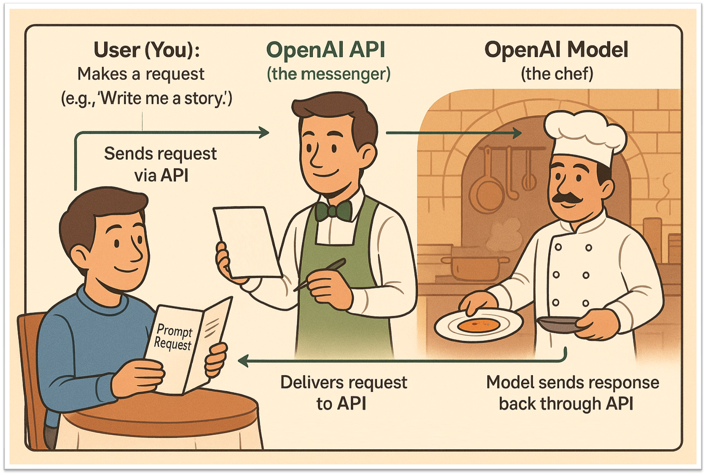

```{r setup, include=FALSE}
knitr::opts_chunk$set(echo = TRUE)
```

## Introduction

Welcome to the **OpenAI API Workshop**.

In this session, we'll start with a brief introduction to APIs and go over some essential programming tools. We'll use a simple analogy to help explain how different models in the OpenAI API work, and we'll carry that analogy throughout the workshop.

You'll learn the building blocks for using generative AI in research. We'll also cover important topics like data privacy and security when working with AI tools.

By the end of this workshop, you will be able to:

- Create an OpenAI account and set up your API key
- Understand how to send and receive requests using the OpenAI API
- Use different models such as text generation-, speech-, and embeddings models
- Be aware of costs, limitations, and ethical considerations

Let's get started.

---

## Prerequisites

Before joining the workshop, make sure you have the following ready:

- A free [OpenAI account](https://platform.openai.com/signup)
- A code editor installed on your computer, such as:
  - **RStudio** – [Install guide via Tilburg Science Hub](https://tilburgsciencehub.com/topics/computer-setup/software-installation/rstudio/r/)
  - **Visual Studio Code (VS Code)** – [Install guide via Tilburg Science Hub](https://tilburgsciencehub.com/topics/Computer-Setup/software-installation/IDE/vscode/)

---

## First OpenAI API Call

We'll start with the most basic way to make an API call to OpenAI's GPT model. To help explain how this works, we'll use a simple restaurant analogy:

- **You (Customer):** The person making the request  
- **OpenAI API (Waiter):** The messenger that takes your request to the AI  
- **GPT Model (Chef):** The system that processes your request and creates the response



### What We'll Do

1. Set up the connection to OpenAI (like finding a restaurant)
2. Create a simple prompt (like placing an order)
3. Get the response (like receiving your meal)

This is the simplest form of an API call — no streaming, no advanced settings — just a basic request and response.

---

### Setting Up Your API Key

Before making your first API call, follow these steps (**Need help seeing it in action?**

1. **Get Your API Key**
  - Use the following [link](https://platform.openai.com/api-keys) and login  
  - Click `Create new secret key`  
  - Copy the key  
    - It looks like this: "sk-..." (keep it safe! You retrieve it only once!)

2. **Option A: Using RStudio (recommended)**
In RStudio, go to the Console pane (bottom left). Type and run this command:
```
usethis::edit_r_environ()
```
A new file will open in the top-left editor pane (your .Renviron file).
If it’s empty, that’s okay!

3. **Store your API key securely:**
Add this line to the file, replacing `sk-xxx...` with your real key:

```
OPENAI_API_KEY=sk-...your-key-here...
```

4. **Save and close the file:**
Press Save (Ctrl + S or Cmd + S).
Now go to the top menu bar and click `Session → Restart `R.
`.Renviron` runs every time R starts, your key will be automatically loaded into memory!

5. **Access Your Key in R Code**
In the Console, type: `Sys.getenv("OPENAI_API_KEY")`, Press Enter.
You should now see your API key appear in the top-right “`Environment`” tab as a variable under `Values.`
If you only see `""`, check if you restarted R correctly and saved the file.
To access your key in a RMarkdown file, use:
```{r set API key}
api_key <- Sys.getenv("OPENAI_API_KEY")
```

Now you're ready to use the OpenAI API securely in your code!

### API Call
We have our access (reservation = API Key) to the restaurant!

From here, we can place our order (prompt) and see what the chef (the model) sends us back. 
Let's make a simple API call now to see how everything comes together.

1. Set up the connection to OpenAI (like finding a restaurant)  
2. Create a simple prompt (like placing an order)  
3. Get the response (like receiving your meal)

This is the simplest form of an API call — no streaming, no advanced parameters — just a basic request and a direct response.

```{r install_openai, echo=FALSE, message=FALSE, warning=FALSE}
# install.packages("openai")  # Uncomment to install
```

```{r first_api_call}
# Waiter: This is the OpenAI API. You talk to it using the 'openai' R package.
library(openai)

# Load the API key from the environment
api_key <- Sys.getenv("OPENAI_API_KEY")

# Customer: This is YOU (or your app). You decide what to ask.
prompt = "Explain photosynthesis in simple terms."

# Chef: This is the AI model (like GPT-4). It prepares the response based on your request.
response = create_chat_completion(
  model = "gpt-4o-mini",
  messages = list(
    list(role = "user", content = prompt)
  ),
  temperature = 0
)

# The response is delivered back to the customer (you)
result <- response$choices$message.content
cat("🧠 Response from the AI (Chef):\n\n")
cat(result, "\n")
```

## Basic Principles

### Looping — _“Ordering Again and Again”_

#### In the Restaurant Metaphor:

Imagine you're really hungry and want to **order multiple dishes**, one after another:

* First: you ask for spaghetti.
* Then: you ask for a drink.
* Then: dessert.

That’s **looping**, doing something **over and over again**, usually **with slight changes**.


##### In Programming/API Terms:

Looping is when your program:

* Sends **multiple API requests** in a row.
* Often in a **`for` loop** or a **`while` loop**.
* Each request might ask a different question or use different data.

**Why It’s Useful:**
* Process a list of texts automatically (e.g., summarizing 100 articles).
* Translate a batch of messages.
* Chat with the model in turns.


**A Quick Look at Loops in R** - Before we start sending multiple questions to the API, let’s look at how Python handles **repeating tasks** using a loop.
Here’s a list of questions we might want to ask the AI. Instead of writing separate code for each one, we can use a **`for` loop** to go through them one by one:

```{r loop_basics}
# Basic R loop — no API yet
questions <- c(
  "What is 1 + 1?",
  "What is the opposite of up?",
  "What is the capital of France?"
)

for (q in questions) {
  cat("Pretend we're asking the AI...", "\n")
  cat(paste("Question:", q),"\n")
  cat("\n")  
}
  
```
**This loop**:
- Goes through the vector of questions
- Stores each question temporarily in the variable `q`
- Prints a message as if we were sending it to the AI

This is the exact kind of structure we’ll use when sending **multiple prompts** to the OpenAI API — but for now, we’re just printing the questions to get used to the idea!

**Looping the OpenAI API -**
Now that we're comfortable with concept of loops, let's send multiple questions to the OpenAI API using a `for` loop, just like placing several orders at a restaurant.
```{r loop_with_api}
questions <- c(
  "What is 1 + 1?",
  "What is the opposite of up?",
  "What is the capital of France?"
)

# Loop through each question and get the AI response
for (q in questions) {
  cat("Pretend we're asking the AI...\n")
  cat("Question:", q, "\n")
  
  response <- create_chat_completion(
    model = "gpt-4o-mini",
    messages = list(
      list(role = "user", content = q)
    ),
    temperature = 0
  )
  
  cat("Answer:", response$choices$message.content, "\n\n")
}
```
Here's what's happening:
1. **We loop through each question** using `for question in questions`.
2. For each one:
   - We **print the question** (the customer asks).
   - We **send the question to the model** using `client.responses.create(...)` (the chef gets to work).
   - We **get the answer** from `response.output_text` (the waiter brings the dish back).
   - Then we **print the AI's reply**.

Just like a waiter taking multiple orders and delivering dishes one at a time, this loop helps us ask several things without repeating our code over and over!

**[WARNING]:** Keep in mind that the API does not 'remember' your previous question

```{r memory demo}
# Demonstrating that the API does NOT have memory between calls

# First call: ask a question
response1 <- create_chat_completion(
    model = "gpt-4o-mini",
    messages = list(
      list(role = "user", content = "My favorite color is blue.")
    ),
    temperature = 0
  )
cat("First response:","\n")
cat("Answer:", response1$choices$message.content, "\n\n")
  
# Second call: refer to the previous message, but without context
response2 <- create_chat_completion(
    model = "gpt-4o-mini",
    messages = list(
      list(role = "user", content = "What is my favorite color?")
    ),
    temperature = 0
  )
cat("Second response (no memory):","\n")
cat("Answer:", response2$choices$message.content, "\n\n")
```
---

## Endpoints — _“Different Sections of the Menu”_

### In the Restaurant Metaphor:

In the restaurant, instead of asking the waiter for everything, you talk to **different workers** for **different tasks**:

You tell the waiter what food you want.  
You ask the bartender for a drink.  
You call the cashier to pay the bill.  

Each worker has a specific job, and you contact the right one depending on what you need.

That's what an **endpoint** is in programming:  
It’s a specific address or route that does one job, like generating text, images, embeddings, transcripts, etc...  You "go" to the right endpoint, and it gives you exactly what you asked for.


### In API Terms:

An **endpoint** is a **URL** where you send your request.

For example, with the OpenAI API:

* `https://api.openai.com/v1/responses` → Talk with ChatGPT, like we just did
* `.../embeddings` → Turn text into numbers (useful for search).
* `.../images/generations` → Generate images from text.
* `.../audio/speech` → Create speech
* `.../audio/transcriptions` → Create transcriptions
* `.../audio/translations` → Create translations

Each one does **something different**, but they all follow the same rules of ordering.

#### Speech Endpoint — Text to Audio with Different Voices
In this example, we use the OpenAI **Text-to-Speech (TTS)** API to convert a line of text into spoken audio using multiple voices.
```{r speech_api_loop}
library(httr)

# Define the voices you want to use
voices <- c("echo", "nova", "shimmer")

# Text to convert to speech
input_text <- "Today, we are testing the OpenAI API. At the moment, we are testing the audio API, during a workshop of Tilburg.ai"

# Get your API key from environment variable
api_key <- Sys.getenv("OPENAI_API_KEY")

# Create output directory if it doesn't exist
output_dir <- "audio"
if (!dir.exists(output_dir)) {
  dir.create(output_dir)
}

# Loop through each voice and generate the speech
for (voice in voices) {
  
  # Define the output file path
  speech_file <- file.path(output_dir, paste0("speech_", voice, ".mp3"))
  
  # Make POST request to OpenAI's speech endpoint
  response <- POST(
    url = "https://api.openai.com/v1/audio/speech",
    add_headers(
      Authorization = paste("Bearer", api_key),
      `Content-Type` = "application/json"
    ),
    body = list(
      model = "tts-1",       # You can also try "tts-1-hd"
      voice = voice,         # Voice: echo, nova, shimmer, etc.
      #langauge="nl",
      input = input_text     # The text you want converted to audio
    ),
    encode = "json",
    write_disk(speech_file, overwrite = TRUE)  # Save output directly to file
  )

  cat("Saved speech to: ", speech_file,"\n")
}
```
**What this does**:
- **Loops** through 3 voice options: `echo`, `nova`, and `shimmer`
- Sends the `input_text` to **OpenAI's speech endpoint**
- Streams the audio response and saves it as an `.mp3` file (one per voice)
- Files will be saved in: `audio/speech_echo.mp3`, `audio/speech_nova.mp3`, etc.

#### Using the Transcription Endpoint — Speech to Text

Now that we’ve generated speech, let’s try the opposite: **transcribing audio back into text** using OpenAI’s transcription API.

```{r transcribe_audio}
audio_file_path <- "audio/speech_echo.mp3"

# Using the transcription endpoint
response <- POST(
  url = "https://api.openai.com/v1/audio/transcriptions",
  add_headers(
    Authorization = paste("Bearer", api_key)
  ),
  body = list(
    model = "whisper-1",
    file = upload_file(audio_file_path, type = "audio/mp3"),
    #language="nl"
    prompt = "Everytime you hear Tilburg AI, note it as Tilburg.ai"
  )
)

cat("Transcript:\n", content(response)$text, "\n")
```

**What this does:**
- Loads the previously generated audio file (from the `echo` voice)
- Sends it to OpenAI’s transcription model (`gpt-4o-transcribe`)
- Optionally, you can:
  - Specify the language with `language="nl"` for Dutch
  - Add a custom prompt to guide transcription formatting
  
### Embeddings Endpoint

**What Are Embeddings?**

Embeddings are a way to turn text (words, sentences, or even whole documents) into numbers so that computers can understand and work with them. Each piece of text is converted into a long list of numbers (called a _vector_) that captures its meaning and context.

- **Why are embeddings useful?**
  - They let computers compare how similar two pieces of text are (e.g., "cat" and "kitten" will have similar embeddings).
  - They are used for search, recommendations, clustering, and many other AI tasks.
  - Embeddings make it possible to do math with language, like finding analogies or grouping similar ideas together.

In the OpenAI API, you can use the embeddings endpoint to get these number representations for your text.

```{r embeddings_example}
library(httr)
library(jsonlite)

# Text to embed
input_text <- "The food was delicious and the waiter..."

# Make the POST request to the embeddings endpoint
response <- POST(
  url = "https://api.openai.com/v1/embeddings",
  add_headers(
    Authorization = paste("Bearer", api_key),
    `Content-Type` = "application/json"
  ),
  body = toJSON(list(
    model = "text-embedding-ada-002",
    input = input_text,
    encoding_format = "float"
  ), auto_unbox = TRUE)
)

embedding <- content(response, as = "parsed")$data[[1]]$embedding
  
# Print the first 50 floats
first_50 <- embedding[1:50]

cat("🔢 First 50 values of embedding:\n")
cat(sprintf("%.6f", first_50), sep = ", ")
cat("\n")
  
# Print total length of the embedding
cat("\nThe embedding is a list of", length(embedding), "floats\n")

```
## Tokens — “How Much You’re Saying”

### In the Restaurant Metaphor:

Imagine you're paying **per word** of your order instead of per item.

Saying:

> “I want spaghetti.”

...costs fewer tokens than:

> “Hello kind waiter, I would like a steaming plate of your finest spaghetti, with extra parmesan on top, please.”

The **longer** or more **complex** your request, the **more tokens** it costs.


### In OpenAI Terms:

- **Tokens = Small chunks of text**, usually a word or part of a word.
- Examples:
  - `"Hello"` → 1 token  
  - `"Artificial intelligence is amazing!"` → ~5 tokens


**Why Tokens Matter:**

- You **pay per token** — for both **input** (your prompt) and **output** (the AI’s reply).
- Each model has a **maximum token limit per request**  
  _(e.g., GPT-4o supports up to ~128,000 tokens)._
- **Shorter, clearer prompts** = faster, cheaper, and often better results.

📌 **Takeaway**: Think of tokens like paying by the word — be thoughtful, but concise!

```{r token_usage_example}
library(httr)
library(jsonlite)

# Define the prompt
prompt <- "Explain API calls in simple terms, using the customer - waiter - chef metaphor."

# API key from environment
api_key <- Sys.getenv("OPENAI_API_KEY")

# Make the API call
response <- POST(
  url = "https://api.openai.com/v1/chat/completions",
  add_headers(
    Authorization = paste("Bearer", api_key),
    `Content-Type` = "application/json"
  ),
  body = toJSON(list(
    model = "gpt-4",
    messages = list(list(role = "user", content = prompt)),
    temperature = 0.7
  ), auto_unbox = TRUE)
)

result <- content(response, as = "parsed")

output_text <- result$choices[[1]]$message$content
cat("Output:\n", output_text, "\n\n")

# Show token usage
usage <- result$usage
cat("Token usage:\n")
cat("Input tokens: ", usage$prompt_tokens, "\n")
cat("Output tokens:", usage$completion_tokens, "\n")
cat("Total tokens: ", usage$total_tokens, "\n")
```

```{r cost_calculation}
# Add cost calculation, $2.00 / 1M input tokens, $8.00 / 1M output tokens
cost_per_million_input_tokens = 2
cost_per_million_output_tokens = 8

total_cost <- (usage$prompt_tokens / 1000000) * cost_per_million_input_tokens + (usage$completion_tokens / 1000000) * cost_per_million_output_tokens

cat("\n","Total cost ($):", total_cost)
```

## From ChatGPT to Azure OpenAI — Steps Toward More Control

When using AI tools, especially in research, **data privacy and control** matter. Here's a quick overview of how the different access methods to OpenAI models compare in terms of data handling:


### 1. **ChatGPT (chat.openai.com)**  
By default, data entered here **may be used to improve OpenAI’s models**.  
However, you can opt out of training by adjusting your settings — we explain how in this article:  
- [ChatGPT & Privacy – Tilburg.ai](https://tilburg.ai/2024/09/chatgpt-privacy/)

### 2. **OpenAI API**  
When using the OpenAI API directly, **your data is not used for training** by default.  
This gives more control compared to ChatGPT, especially when working with sensitive or research-related data.

### 3. **Azure OpenAI (portal.azure.com)**  
For the highest level of control, especially within institutions:
**Azure OpenAI** gives you access to OpenAI’s models (like GPT-4) via Microsoft’s Azure cloud
This means:

- **Data Privacy**  
  Your data stays within your Azure environment and is **not used for training**.

- **Security & Compliance**  
  Built on Azure’s infrastructure with support for enterprise-grade security and compliance requirements.

- **Regional Deployment**  
  Models can be deployed in **European data centers**, addressing common concerns around sending research data to U.S.-based servers.

**Summary:** If you're handling sensitive or regulated data, **moving from ChatGPT to API to Azure OpenAI** is a progression toward **greater privacy, compliance, and control**.

**Using `.env` Variables with Azure OpenAI**

Just like with the OpenAI API key, it's important to use a `.Renviron` file when working with Azure OpenAI.

When dealing with APIs — especially in cloud environments, it’s considered best practice to **avoid hard-coding sensitive information** (like API keys, endpoints, or version numbers) directly into your script.

Instead, we store these values in a hidden `.Renviron` file and access them in the code using `Sys.getenv()`.  
This keeps your credentials secure, your code cleaner, and makes it easier to manage different environments.

```{r azure_chat_call}
# Load your Azure OpenAI credentials from environment variables
api_key <- Sys.getenv("AZURE_OPENAI_API_KEY")
api_version <- Sys.getenv("API_VERSION")
endpoint <- Sys.getenv("AZURE_OPENAI_ENDPOINT") 
deployment <- Sys.getenv("MODEL_VERSION")  

# Construct the request URL for chat completions
url <- endpoint

# Define the conversation messages
messages <- list(
  list(role = "system", content = "You are a helpful assistant."),
  list(role = "assistant", content = "Knock knock."),
  list(role = "user", content = "Who's there?"),
  list(role = "assistant", content = "Lettuce."),
  list(role = "user", content = "Give me an example of the stelling van Pythagoras and how to use it in real life")
)

# Send the POST request
response <- POST(
  url = url,
  add_headers(
    `Content-Type` = "application/json",
    `api-key` = api_key
  ),
  body = toJSON(list(
    messages = messages,
    temperature = 0.7
  ), auto_unbox = TRUE)
)

# Handle the response
result <- content(response, as = "parsed")
message <- result$choices[[1]]$message
cat(paste0(message$role, ": ", message$content, "\n"))
```

---

### Case Study: Finding Similar Scientific Texts Using Embeddings

In this case study, we demonstrate how to use **OpenAI embeddings** to search for the most relevant scientific text snippet from a collection — based on a user’s query.

#### What We’ll Do:

1. **Embed** a list of scientific text snippets.
2. **Embed** the search query.
3. **Calculate similarity** between the query embedding and each text embedding.
4. **Identify and return** the most similar text snippet.

This approach is useful for tasks like semantic search, content recommendation, or academic literature retrieval.

```{r install_lsa}
options(repos = c(CRAN = "https://cloud.r-project.org"))

# Then install the lsa package
install.packages("lsa")
```

```{r embedding_similarity_case}
library(httr)
library(jsonlite)
library(lsa)  # for cosine similarity

# Set API key
api_key <- Sys.getenv("OPENAI_API_KEY")

# Define scientific articles
scientific_articles <- c(
  "Photosynthesis is the process by which green plants and some other organisms use sunlight to synthesize foods with the help of chlorophyll. During photosynthesis in green plants, light energy is captured and used to convert water, carbon dioxide, and minerals into oxygen and energy-rich organic compounds.",
  
  "Gravity is a fundamental force of nature that causes objects with mass or energy to be attracted to each other. It is responsible for phenomena such as the falling of objects to the ground and the orbits of planets around the Sun. The force of gravity is proportional to the product of the two masses and inversely proportional to the square of the distance between their centers.",
  
  "Evolution is the change in the heritable characteristics of biological populations over successive generations. Evolutionary processes give rise to biodiversity at every level of biological organization, including the levels of genes, individual organisms, and the structure and function of ecosystems. Evolutionary biology is a subfield of biology that studies the evolutionary processes that produced the diversity of life on Earth."
)

# Function to get an embedding for a single text
get_embedding <- function(text, api_key) {
  res <- POST(
    url = "https://api.openai.com/v1/embeddings",
    add_headers(
      Authorization = paste("Bearer", api_key),
      `Content-Type` = "application/json"
    ),
    body = toJSON(list(
      model = "text-embedding-ada-002",
      input = text,
      encoding_format = "float"
    ), auto_unbox = TRUE)
  )
  
  if (status_code(res) == 200) {
    return(content(res)$data[[1]]$embedding)
  } else {
    stop("Embedding request failed: ", content(res))
  }
}

# Get embeddings for the articles
article_embeddings <- lapply(scientific_articles, get_embedding, api_key = api_key)

# Get embedding for the query
query <- "Tell me about plants creating food from sunlight."
query_embedding <- get_embedding(query, api_key = api_key)

# Compute cosine similarity between query and each article
similarities <- sapply(article_embeddings, function(article_emb) {
  cosine(as.numeric(query_embedding), as.numeric(article_emb))
})

# Find the most similar article
most_similar_index <- which.max(similarities)
most_similar_article <- scientific_articles[most_similar_index]

# Output the result
cat("Query:\n", query, "\n\n")
cat("Most similar article:\n", most_similar_article, "\n\n")
cat("Similarity score:", round(similarities[most_similar_index], 4), "\n")
```

---

## Wrapping Up — What We've Learned

In this workshop, we walked through the all the steps needed to interact with OpenAI's API, from the basics to more advanced use cases.

### Topics We Covered:

- What an API is, and how OpenAI's API works
- Why and how to securely use your **API key** with a `.Renviron` file
- Making your **first API call** using a simple prompt
- Looping over multiple questions using Python
- Used different endpoints:
  - Using **speech synthesis** (text-to-audio) and **transcription** (audio-to-text)
  - Used an **embedding** model
- Understanding **tokens** — how pricing and length work
- Case study of using **embeddings** to find semantically similar scientific texts
- Comparing **ChatGPT**, **OpenAI API**, and **Azure OpenAI** in terms of control and data privacy
